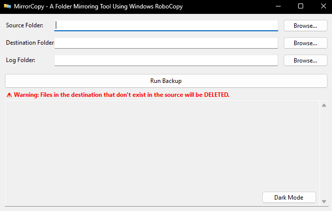

# MirrorCopy

MirrorCopy is a lightweight Windows application designed to simplify the process of mirroring directories using `robocopy`. It provides a user-friendly interface for selecting source and destination folders, executing the copy operation, and viewing logs. It also supports command-line arguments for automated backups.

## Releases

Find the latest stable releases and previous versions [here](https://github.com/AlfredoFilho/MirrorCopy/releases).

## Features

* **Directory Mirroring**: Easily synchronize source and destination folders using `robocopy /MIR`.
* **Preview Mode**: Before executing the actual copy, preview the changes that `robocopy` will make.
* **Logging**: All `robocopy` output is captured and saved to a log file for review.
* **Dark Mode**: Toggle between light and dark themes for improved user experience.
* **System Tray Integration**: Minimize the application to the system tray to run backups in the background.
* **Command-Line Interface (CLI) Support**: Automate backups by providing source and destination paths via command-line arguments.
* **Configuration Saving**: The last used source, destination, log path, and theme preference are saved for convenience.

## Screenshots

### Main Interface  
  
The main window of MirrorCopy, where you can easily configure source and destination folders for mirrored backups.

### Running in the Background  
  
MirrorCopy runs quietly in the background, ensuring your backups are performed without interrupting your workflow.

### System Tray Icon  
  
The application remains active even when minimized, accessible through the system tray for quick access.

## How to Use

### Graphical User Interface (GUI)

1.  **Select Source Folder**: Click the "Browse" button next to the "Source Folder" text box and choose the directory you want to mirror.
2.  **Select Destination Folder**: Click the "Browse" button next to the "Destination Folder" text box and choose where you want to copy the files.
3.  **Select Log Folder (Optional)**: Click the "Browse" button next to the "Log Folder" text box to specify where the backup logs should be saved. If left blank, logs will be saved in the application's directory.
4.  **Toggle Theme**: Click the "Dark Mode" or "Light Mode" button to switch between themes.
5.  **Execute Backup**: Click the "Execute Backup" button. A preview window will appear showing the `robocopy` command and its output. Confirm to proceed with the actual backup.
6.  **Monitor Progress**: The "Output" text area will display the real-time progress of the `robocopy` operation.
7.  **Minimize to Tray**: Minimize the application window to send it to the system tray. Double-click the tray icon to restore the window.

### Command-Line Interface (CLI)

You can run MirrorCopy from the command line for automated backups.

```bash
MirrorCopy.exe /source "C:\Path\To\Source" /destination "D:\Path\To\Destination"
```